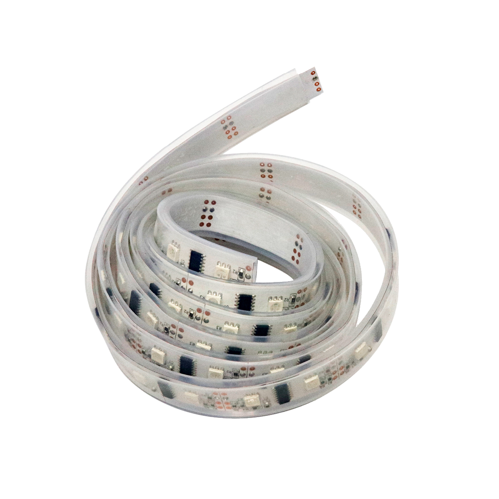
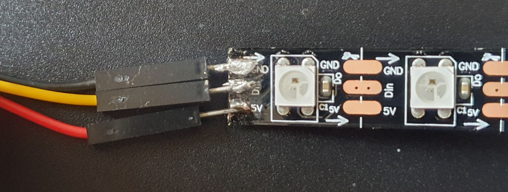
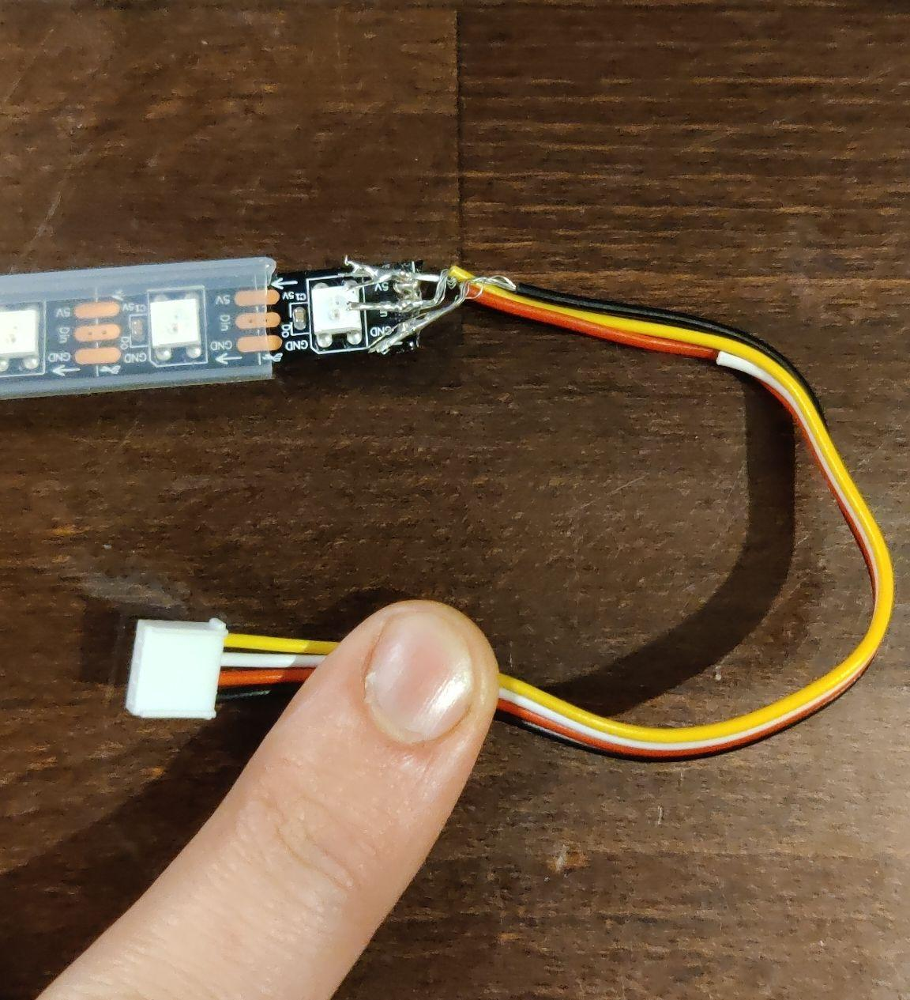

# LED-Streifen

## Beschreibung

Der LED-Streifen kann Lichteffekte und -animationen erzeugen oder kommt auch einfach zur Beleuchtung zum Einsatz.
Er lässt sich dabei beliebig zuschneiden und wieder zusammenlöten.
Weiterhin kann jede einzelne LED in Farbe und Helligkeit individuell gesteuert werden.
Dadurch ist es möglich, bunte und schöne Lichteffekte zu programmieren.

<!-- more_details -->

Der LED-Streifen kann direkt oder mithilfe des Grove Shields an einen Arduino oder Raspberry Pi angeschlossen werden.
Der Streifen wird über ein kombiniertes Zeit & Daten-Signal gesteuert.
Hierfür wird nur ein digitaler Pin am Mikrocontroller benötigt.

@[youtube](https://www.youtube.com/watch?v=e0CBo3xn858)

### Anleitung

1. Schneide den LED-Streifen an den eingezeichneten weißen Strichen auf die gewünschte Länge zu. Nehme nicht mehr als fünf LEDs, da der Arduino sonst nicht genug Strom hat, um es zu versorgen. Mehr dazu unten.
1. Nehme ein Grove-Kabel und schneide ein Ende ab. Löte die losen einzelnen Kabel an die Kontakte des LED-Streifens (schwarz = GND, rot = 5V, gelb = Din). **ACHTUNG**: Achte darauf, dass du die Kabel am richtigen Ende des LED-Streifens verlötest. Die eingezeichneten Pfeile müssen von der Lötstelle wegzeigen (siehe Fotos).  
  
  
1. Schließe das Grove Kabel an digitalen Pin `D2` am Grove Shield an.
1. Nehme das Codebeispiel von unten und lade es ins Programm. Falls du einen anderen Pin gewählt hast, passe die Variable PIN im Code an.
1. Ändere im Code die Variable `NUMPIXELS` so ab, sodass sie gleich der Zahl der LEDs auf dem Streifen ist.
1. Klicke am linken Rand der Arduino IDE auf den Knopf mit dem Büchersymbol (der Bibliotheksverwalter) und suche nach `Adafruit NeoPixel`, klicke anschließend auf installieren.
1. Lade den Code auf den Arduino hoch. Die LEDs sollten nun sich wiederholend nacheinander an- und ausgehen.

### Stromversorgung

Grob gesagt braucht jeder einzelne Pixel bis zu 60mA (wenn du ihn 100% Weiß leuchten lässt).
Ab einer Länge von fünf LEDs wird empfohlen, den LED-Streifen an eine externe Stromquelle anzuschließen.
( 5 \* 0,06A = 300mA; normales USB erlaubt max. 500mA ).
Werden längere LED-Streifen in Betracht gezogen, so sollte eine Stromeinspeisung mindestens jeden Meter erfolgen, um alle LEDs gleichmäßig mit Spannung zu versorgen.

## Codebeispiele

!!!show-examples:./examples/

<!-- infolist -->

## Wichtige Links für die ersten Schritte:

Alle weiteren Hintergrundinformationen sowie ein Beispielaufbau sind auf der Produktseite zu finden.
Auch eine ausführliche Anleitung zu NeoPixel-LED-Streifen ist weiter unten verlinkt.
Die Anleitung sollte mit größter Sorgfalt Schritt für Schritt abgearbeitet werden, um Schäden am LED-Streifen & Controller zu vermeiden.
Zusätzliche Informationen findet man über alle gängigen Suchmaschinen, in dem nach „NeoPixel LED-Streifen“ und „Arduino“ gesucht wird.

- [Adafruit NeoPixel LED-Streifen - Produktseite](https://www.adafruit.com/product/1138?length=1)
- [Adafruit NeoPixel – Ausführliche Anleitung](https://learn.adafruit.com/adafruit-neopixel-uberguide)
- [FastLED – NeoPixel LED-Streifen Animations-Bibliotheken](http://fastled.io/)

## Projektbeispiele:

- [Hackster – Indoor NeoPixel Thermometer](https://www.hackster.io/hackerEsk/indoor-neopixel-thermometer-64f22e)
- [Adafruit - Neopixel Jewel Necklace](https://learn.adafruit.com/10-minute-neopixel-necklace)
- [Adafruit - NeoPixel LED Sound Reactive Drums](https://learn.adafruit.com/gemma-powered-neopixel-led-sound-reactive-drums)
- [Adafruit - NeoPixel LED Necklace Insert](https://learn.adafruit.com/neopixel-led-necklace-insert-with-usb-charging)
- [Adafruit - NeoPixel Basketball Hoop](https://learn.adafruit.com/neopixel-mini-basketball-hoop)
