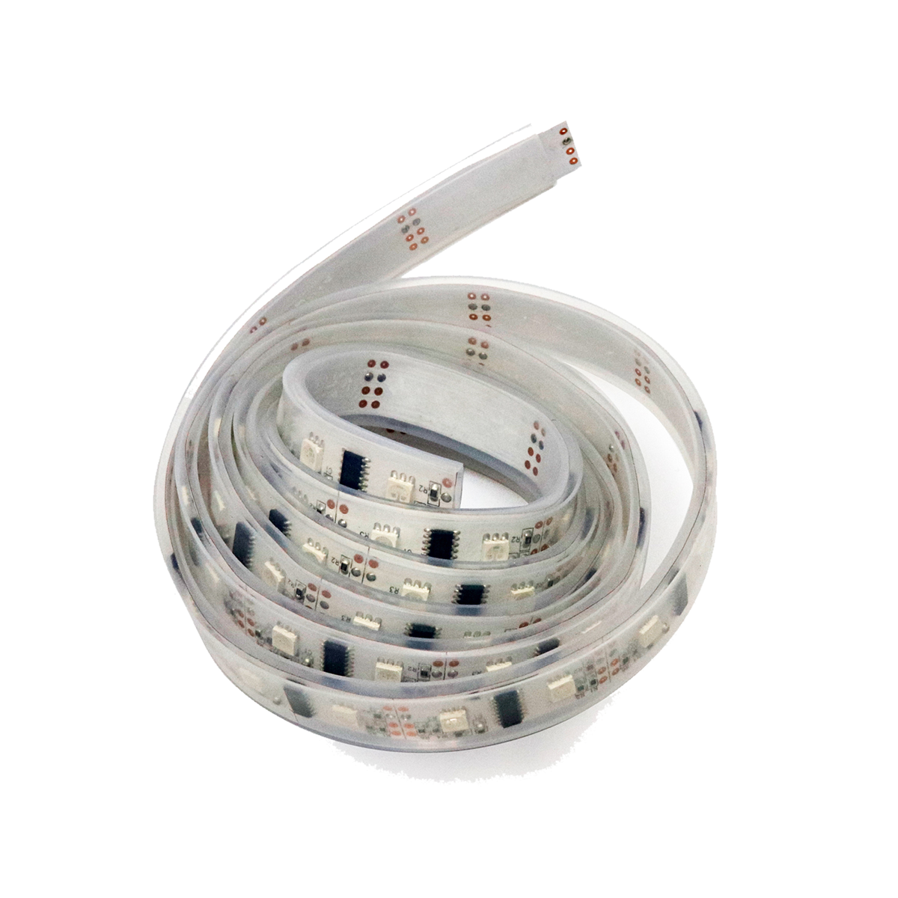

# LED-Streifen

## Beschreibung
Der LED-Streifen kann Lichteffekte und -animationen erzeugen oder kommt auch einfach zur Beleuchtung zum Einsatz. Er lässt sich dabei beliebig zuschneiden und wieder zusammenlöten. Weiterhin kann jede einzelne LED in Farbe und Helligkeit individuell gesteuert werden. Dadurch ist es möglich, komplexe Lichteffekte zu realisieren.

Der LED-Streifen kann direkt oder mithilfe des Grove Shields an einen Arduino oder Raspberry Pi angeschlossen werden. Da der Streifen über ein PWM-Signal gesteuert wird, wird nur ein digitaler Pin am Mikrocontroller benötigt.

Ab einer Länge von fünf LEDs wird empfohlen, den LED-Streifen an eine externe Stromquelle anzuschließen. Werden längere LED-Streifen in Betracht gezogen so sollte eine Stromeinspeisung mindestens jeden Meter erfolgen, um alle LEDs gleichmäßig mit Strom zu versorgen.

Alle weiteren Hintergrundinformationen sowie ein Beispielaufbau sind auf der Produktseite zu finden. Eine ausführliche Anleitung zu NeoPixel-LED-Streifen ist weiter unten verlinkt. Die Anleitung sollte mit größter Sorgfalt Schritt für Schritt abgearbeitet werden, um Schäden am LED-Streifen zu vermeiden. Zusätzliche Informationen findet man über alle gängigen Suchmaschinen, indem nach „NeoPixel LED-Streifen“ und „Arduino“ gesucht wird.

https://youtu.be/e0CBo3xn858?feature=shared

 

## Beispiele

!!!show-examples:./examples/

<!-- infolist -->

## Wichtige Links für die ersten Schritte:

- [Adafruit NeoPixel LED-Streifen - Produktseite](https://www.adafruit.com/product/1138?length=1)
- [Adafruit NeoPixel – Ausführliche Anleitung](https://learn.adafruit.com/adafruit-neopixel-uberguide)
- [FastLED – NeoPixel LED-Streifen Animations-Bibliotheken](http://fastled.io/)

## Projektbeispiele:

- [Hackster – Indoor NeoPixel Thermometer](https://www.hackster.io/hackerEsk/indoor-neopixel-thermometer-64f22e)

## Weiterführende Hintergrundinformationen:

- [I2C - Wikipedia Artikel](https://de.wikipedia.org/wiki/I%C2%B2C)
- [SPI - Wikipedia Artikel](https://de.wikipedia.org/wiki/Serial_Peripheral_Interface)
- [UART - Wikipedia Artikel](https://de.wikipedia.org/wiki/Universal_Asynchronous_Receiver_Transmitter)
- [GitHub-Repository: LED-Streifen](https://github.com/MakeYourSchool/65-LED-Streifen)

